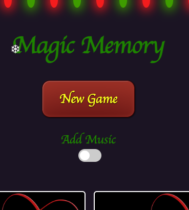
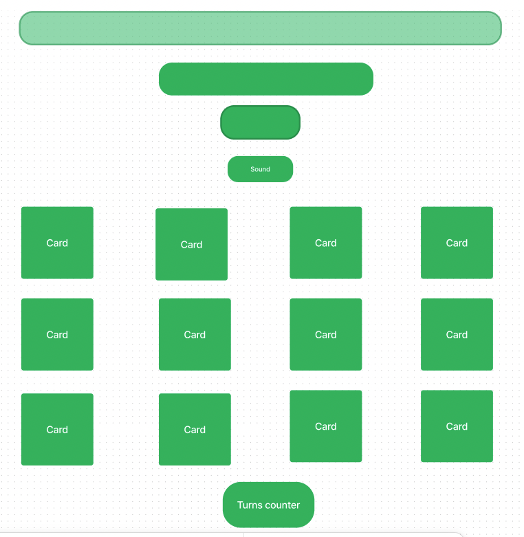

<a href="zenas-memory-game.surge.sh">Play</a>
Magic Memory
A single-page application (SPA) which allows the user to manage keto recipes.

💻 Click here to see our live project!
ℹ️ About
It's a CRUD (Create Read Update Delete) app. This is a group project by Zena, George and Asela.

We used the Scavenger Hunt app as a guide when writing it. It was written in a step by step process. We collaborated via GitHub.

This app uses the Model View Controller framework. The user has the ability to add, edit and delete recipes.

📝 Planning & Problem Solving -
We began our planning on a Trello board. In the user stories, we listed functions to create for that user story with brief information.

Trello board image: TBImage

Wireframes: Wireframes

Block diagram of how components relate to each other: BlockDiagram

When we had problems, we spent time together working on fixing it. Screen sharing on Zoom was used allowing all team members to see the problem.

🚀 Cool Tech
This is an Express app developed in the Node.js platform. There is JavaScript, HTML, CSS and SQL databases. The database uses PSQL. Three CSS files are used. Bcrypt was used to hash passwords for security purposes.

😧 Bugs to Fix
We didn't use branches at the beginning which resulted in problems. We then realised the importance of using branches and listed the method of doing it based on the instructions and the IAs assistance. After using branches, there were some errors and incidents of merge conflicts. We worked together to fix them.

Creating the edit function took a lot of time to do with a major error ocurring.

The logout function kept having problems. We were able to get it mostly functioning properly in our local versions.

😣 Lessons Learnt
It took time to get used to how branches work and the correct way to use them. We encountered problems with collaborating via GitHub as some mistakes were made in the process of collaboration. These mistakes were fixed. We should have used branches and developed the steps on how to collaborate from the very beginning of the project.

## Magic Memory Game

- I created a React Magic Memory Game as a final project of General Assembly's Software Engineering Immersive Course. This is frontend project created using React JavaScript Library, Howler JavaScript Audio Library, and CSS  

## :computer: [Click here](https://zenas-memory-game.surge.sh/) to see my live project!

## :speech_balloon: About

- How to use Magic Memory Game.
To start the game just press the New Game button. 
Do not forget to toggle the Add Music to add more Magic to your experience.

## :memo: Planning & Problem Solving

- I started planning with working on game logic.
Creating the wireframe for the page.

Finding and adjusting images.
The Audio Library I hoped to use was depreciated and I found Howler JS Audio Library and use it instead.

## :rocket: Cool tech
- Programming languages:
  React
  React Hooks: useState and useEffect
  CSS
  Howler JavaScript Audio Library

## :Animations
Anything else you'd be proud to show your parents
😱 Bugs to fix 💩
Anything a little broken
Anything a LOT broken
Buttons to not click too many times (cause its broken 😒)
😭 Lessons learnt
What I would do differently if I could wind back the clock...

✅ Future features
Cool things I would add if I can keep working on this

